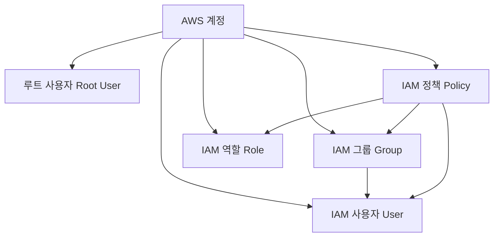
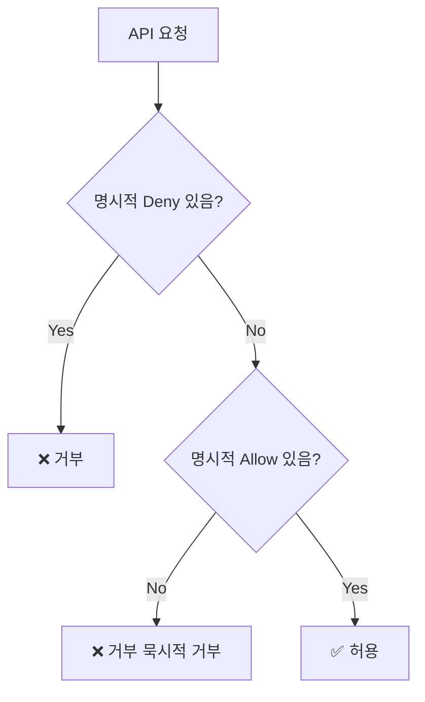
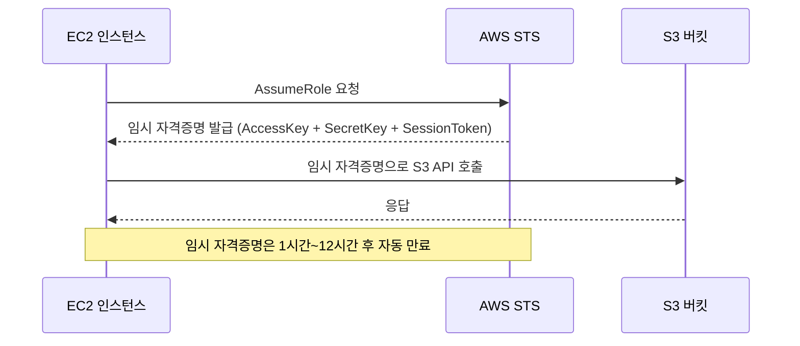
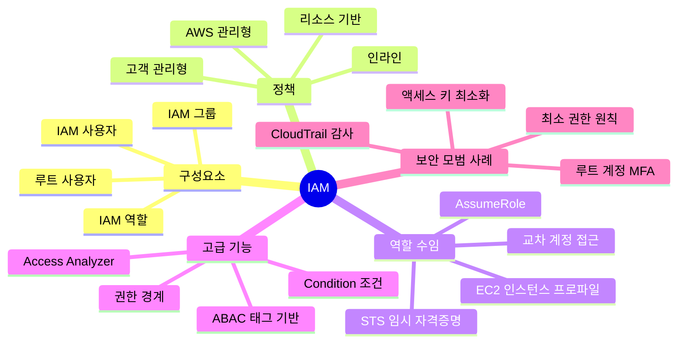

# AWS IAM 완벽 정리 — 사용자, 역할, 정책의 모든 것

AWS를 사용하다 보면 가장 먼저, 그리고 가장 자주 마주치는 서비스가 바로 **IAM(Identity and Access Management)** 입니다. IAM을 제대로 이해하지 않으면 보안 사고로 이어질 수 있고, AWS 자격증 시험에서도 가장 비중이 높은 주제 중 하나입니다.

이 글에서는 IAM의 핵심 개념부터 정책 JSON 작성법, 실무 모범 사례까지 깊이 있게 정리합니다.

---

## 1. IAM이란?

IAM은 AWS 리소스에 대한 **접근 권한을 중앙에서 관리**하는 서비스입니다.

- **"누가(Who)"** — 사용자, 애플리케이션, AWS 서비스
- **"무엇을(What)"** — S3 버킷 읽기, EC2 인스턴스 시작, RDS 접속 등
- **"어디서(Where)"** — 특정 리소스, 특정 조건 하에서

IAM은 **글로벌 서비스**입니다. 리전에 종속되지 않고 AWS 계정 전체에 적용됩니다.

---

## 2. IAM 핵심 구성요소



### 루트 사용자 (Root User)
AWS 계정 생성 시 자동으로 만들어지는 **최고 관리자 계정**입니다.

- 이메일 + 비밀번호로 로그인
- 모든 AWS 서비스와 리소스에 대한 완전한 권한 보유
- ⚠️ **절대 일상적인 작업에 사용하면 안 됩니다**
- 루트 계정으로만 할 수 있는 작업: 계정 해지, 지원 플랜 변경, 결제 정보 수정 등

### IAM 사용자 (User)
AWS 내에서 생성하는 **개별 사람 또는 애플리케이션의 계정**입니다.

- 콘솔 접근용: 아이디 + 비밀번호
- 프로그래밍 접근용: **액세스 키(Access Key ID + Secret Access Key)**
- 하나의 AWS 계정에 최대 **5,000명**의 IAM 사용자 생성 가능
- 기본적으로 어떤 권한도 없음 → 명시적으로 권한 부여 필요

### IAM 그룹 (Group)
IAM 사용자들의 **집합**입니다. 공통 권한을 그룹 단위로 관리합니다.

- 그룹에 정책을 연결하면 그룹의 모든 사용자가 해당 권한을 상속
- 사용자는 여러 그룹에 속할 수 있음
- 그룹은 다른 그룹을 포함할 수 없음 (중첩 불가)
- 그룹 자체는 로그인 불가 (자격증명 없음)

```
[개발팀 그룹] → EC2 Full Access, S3 Read Access 정책 연결
    ├── 김개발 (사용자)   → EC2 Full + S3 Read 권한 자동 상속
    ├── 이개발 (사용자)   → EC2 Full + S3 Read 권한 자동 상속
    └── 박개발 (사용자)   → EC2 Full + S3 Read 권한 자동 상속
```

### IAM 역할 (Role)
**특정 AWS 서비스나 계정이 임시로 권한을 위임받는** 메커니즘입니다.

- 사람이 아닌 **서비스(EC2, Lambda 등)** 가 주로 사용
- 영구적인 자격증명이 아닌 **임시 자격증명(STS 토큰)** 발급
- 교차 계정 접근(Cross-Account Access)에도 활용

사용 예시:
- EC2 인스턴스가 S3 버킷에 접근할 때
- Lambda 함수가 DynamoDB를 읽을 때
- 다른 AWS 계정의 사용자가 이 계정 리소스에 접근할 때

---

## 3. IAM 정책 (Policy) 심화

정책은 **JSON 문서** 형태로 작성하며, 어떤 리소스에 어떤 행동을 허용/거부할지 정의합니다.

### 정책 JSON 구조

```json
{
  "Version": "2012-10-17",
  "Statement": [
    {
      "Sid": "AllowS3ReadOnly",
      "Effect": "Allow",
      "Action": [
        "s3:GetObject",
        "s3:ListBucket"
      ],
      "Resource": [
        "arn:aws:s3:::my-bucket",
        "arn:aws:s3:::my-bucket/*"
      ],
      "Condition": {
        "StringEquals": {
          "aws:RequestedRegion": "ap-northeast-2"
        }
      }
    }
  ]
}
```

### 주요 필드 설명

| 필드 | 필수 | 설명 |
|------|------|------|
| `Version` | ✅ | 정책 언어 버전, 항상 `"2012-10-17"` 사용 |
| `Statement` | ✅ | 권한 규칙의 배열 |
| `Sid` | ❌ | Statement ID, 설명용 식별자 |
| `Effect` | ✅ | `"Allow"` 또는 `"Deny"` |
| `Action` | ✅ | 허용/거부할 AWS API 작업 |
| `Resource` | ✅ | 대상 리소스의 ARN |
| `Condition` | ❌ | 정책이 적용될 조건 |
| `Principal` | 🔶 | 리소스 기반 정책에서 대상 지정 |

### ARN (Amazon Resource Name)

ARN은 AWS 리소스를 **전 세계적으로 유일하게 식별**하는 이름 형식입니다.

```
arn:partition:service:region:account-id:resource

예시:
arn:aws:s3:::my-bucket                          → S3 버킷
arn:aws:ec2:ap-northeast-2:123456789:instance/i-1234  → EC2 인스턴스
arn:aws:iam::123456789:user/kim                 → IAM 사용자
arn:aws:iam::123456789:role/MyRole              → IAM 역할
```

와일드카드 사용:
- `*` — 모든 것 (`"Action": "s3:*"` → S3 모든 작업)
- `?` — 단일 문자

### 정책의 종류

| 종류 | 설명 | 연결 대상 |
|------|------|-----------|
| **관리형 정책 (AWS Managed)** | AWS가 미리 만든 정책 | User, Group, Role |
| **고객 관리형 정책 (Customer Managed)** | 사용자가 직접 만든 정책 | User, Group, Role |
| **인라인 정책 (Inline)** | 특정 대상에 직접 삽입, 1:1 관계 | User, Group, Role |
| **리소스 기반 정책 (Resource-Based)** | 리소스에 직접 연결 | S3, SQS, Lambda 등 |

---

## 4. 정책 평가 로직 (Authorization Model)

IAM은 여러 정책이 겹칠 때 **명확한 우선순위**로 권한을 판단합니다.



**핵심 규칙:**
1. 기본적으로 **모든 것은 거부(묵시적 거부)**
2. 명시적 `Allow`가 있으면 허용
3. 명시적 `Deny`가 있으면 **Allow보다 항상 우선** → 최종 거부

---

## 5. IAM 역할 (Role) 심화

### 역할의 두 가지 정책

역할은 두 종류의 정책을 함께 사용합니다.

**① 신뢰 정책 (Trust Policy)**
역할을 "누가 맡을 수 있는지" 정의합니다.

```json
{
  "Version": "2012-10-17",
  "Statement": [
    {
      "Effect": "Allow",
      "Principal": {
        "Service": "ec2.amazonaws.com"
      },
      "Action": "sts:AssumeRole"
    }
  ]
}
```

**② 권한 정책 (Permission Policy)**
역할을 맡은 주체가 "무엇을 할 수 있는지" 정의합니다.

```json
{
  "Version": "2012-10-17",
  "Statement": [
    {
      "Effect": "Allow",
      "Action": ["s3:GetObject", "s3:PutObject"],
      "Resource": "arn:aws:s3:::my-app-bucket/*"
    }
  ]
}
```

### 역할 수임(AssumeRole) 흐름



### 역할 주요 사용 사례

**1. EC2 인스턴스 프로파일**
```
EC2 서버 → IAM 역할(S3 접근 권한) → S3 버킷 읽기/쓰기
```
코드에 액세스 키를 하드코딩하지 않아도 됩니다. 실무 필수 패턴!

**2. Lambda 실행 역할**
```
Lambda 함수 → IAM 역할(DynamoDB, CloudWatch 권한) → 로그 기록 + DB 쿼리
```

**3. 교차 계정 접근 (Cross-Account)**
```
계정 A의 사용자 → 계정 B의 역할 수임 → 계정 B 리소스 접근
```
멀티 계정 환경에서 별도 사용자 생성 없이 권한 위임 가능

---

## 6. 권한 경계 (Permission Boundary)

권한 경계는 IAM 사용자나 역할이 **가질 수 있는 최대 권한의 한계**를 설정합니다.

```
실제 권한 = 연결된 정책 ∩ 권한 경계

예시:
- 연결된 정책: S3 Full Access + EC2 Full Access
- 권한 경계: S3만 허용
- 실제 권한: S3 Full Access만 유효
```

주로 **권한 위임 시나리오**에서 사용됩니다. 주니어 개발자에게 IAM 역할 생성 권한을 주되, 자기 자신보다 강한 권한의 역할을 만들지 못하도록 제한할 때 활용합니다.

---

## 7. STS (Security Token Service)

STS는 **임시 자격증명을 발급**해주는 서비스입니다. IAM 역할과 함께 동작합니다.

| API | 설명 |
|-----|------|
| `AssumeRole` | IAM 역할의 임시 자격증명 획득 |
| `AssumeRoleWithWebIdentity` | Google, Facebook 등 외부 ID로 역할 수임 |
| `AssumeRoleWithSAML` | SAML 기반 SSO로 역할 수임 |
| `GetSessionToken` | MFA 사용 시 임시 자격증명 획득 |

임시 자격증명 구성:
- `AccessKeyId` — 액세스 키 ID
- `SecretAccessKey` — 비밀 액세스 키
- `SessionToken` — 세션 토큰 (영구 자격증명과 구별되는 핵심)
- `Expiration` — 만료 시간

---

## 8. Condition (조건) 활용

Condition을 사용하면 더 세밀한 접근 제어가 가능합니다.

**MFA 인증한 경우에만 허용:**
```json
{
  "Effect": "Allow",
  "Action": "ec2:TerminateInstances",
  "Resource": "*",
  "Condition": {
    "Bool": {
      "aws:MultiFactorAuthPresent": "true"
    }
  }
}
```

**특정 IP에서만 허용:**
```json
{
  "Effect": "Deny",
  "Action": "s3:*",
  "Resource": "*",
  "Condition": {
    "NotIpAddress": {
      "aws:SourceIp": ["203.0.113.0/24", "198.51.100.0/24"]
    }
  }
}
```

**태그 기반 접근 제어 (ABAC):**
```json
{
  "Effect": "Allow",
  "Action": "ec2:*",
  "Resource": "*",
  "Condition": {
    "StringEquals": {
      "ec2:ResourceTag/Team": "${aws:PrincipalTag/Team}"
    }
  }
}
```
→ 사용자의 `Team` 태그와 EC2 인스턴스의 `Team` 태그가 같을 때만 접근 허용

---

## 9. IAM 보안 모범 사례

### ✅ 루트 계정 보호
- MFA(Multi-Factor Authentication) 반드시 활성화
- 액세스 키 절대 생성 금지
- 일상 작업에는 절대 사용 금지

### ✅ 최소 권한 원칙 (Least Privilege)
필요한 최소한의 권한만 부여합니다.

```
❌ 나쁜 예: "Action": "*", "Resource": "*"  (관리자 권한 남용)
✅ 좋은 예: "Action": "s3:GetObject", "Resource": "arn:aws:s3:::specific-bucket/*"
```

### ✅ IAM Access Analyzer 활용
외부에 노출된 리소스, 과도한 권한 등을 **자동으로 분석**해서 알려줍니다.
- 외부 엔티티가 접근 가능한 리소스 탐지
- 미사용 권한 분석 (IAM Access Analyzer for unused access)

### ✅ 액세스 키 관리
- 액세스 키는 **필요한 경우에만** 발급 (CLI, SDK 사용 시)
- EC2, Lambda 등에서는 역할을 사용하고 액세스 키 사용 금지
- 키 주기적 교체 (90일 이내 권장)
- 사용하지 않는 키 즉시 비활성화/삭제

### ✅ MFA 활성화
모든 사용자, 특히 권한 있는 계정에는 반드시 MFA를 적용합니다.

```json
{
  "Effect": "Deny",
  "NotAction": [
    "iam:CreateVirtualMFADevice",
    "iam:EnableMFADevice",
    "iam:GetUser",
    "iam:ListMFADevices",
    "iam:ListVirtualMFADevices",
    "sts:GetSessionToken"
  ],
  "Resource": "*",
  "Condition": {
    "BoolIfExists": {
      "aws:MultiFactorAuthPresent": "false"
    }
  }
}
```

### ✅ CloudTrail로 감사 로그 활성화
모든 IAM API 호출을 기록하여 보안 사고 발생 시 추적 가능하게 합니다.

---

## 10. IAM 주요 개념 정리



---

## 마무리

IAM은 AWS 보안의 **첫 번째 방어선**입니다. 아무리 좋은 애플리케이션을 만들어도 IAM 설정이 잘못되면 보안 사고로 이어질 수 있습니다.

핵심 정리:
- **User**: 사람 또는 앱의 영구 자격증명
- **Group**: 사용자 집합, 공통 권한 관리
- **Role**: 서비스/계정이 임시로 맡는 권한 (실무에서 가장 많이 씀)
- **Policy**: JSON으로 권한 정의, Deny > Allow
- **최소 권한 원칙**은 항상 지킬 것

> 📌 다음 글에서는 **VPC(Virtual Private Cloud)** 를 심화 정리할 예정입니다. 네트워크 설계의 기본기인 서브넷, 라우팅 테이블, 보안 그룹을 다룹니다.
