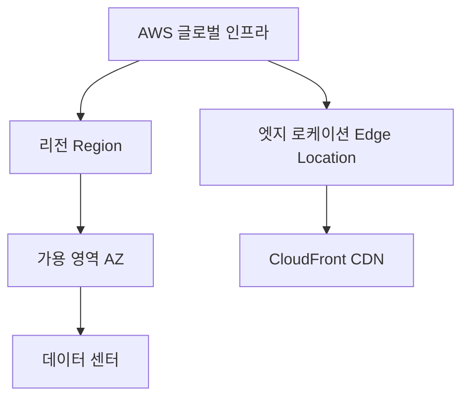
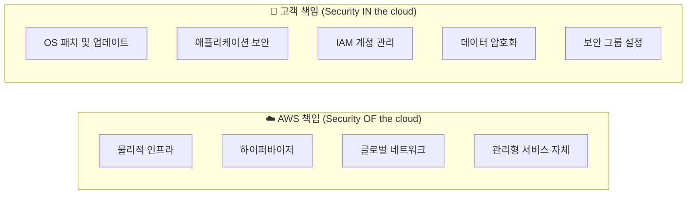
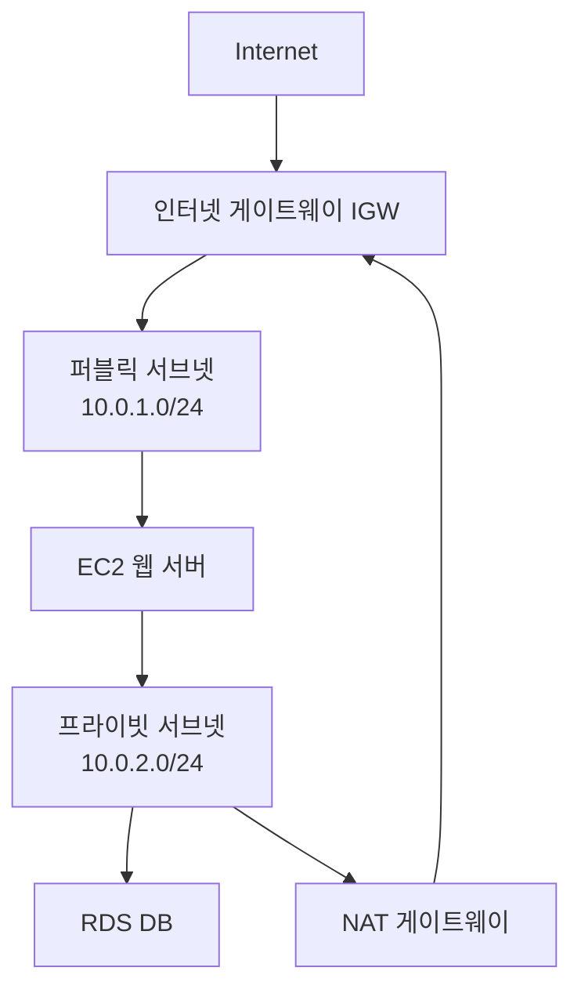
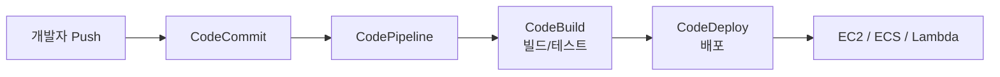
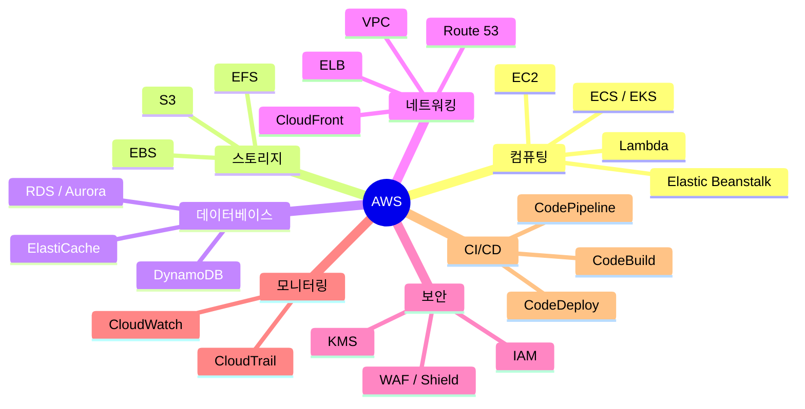

# AWS 핵심 정리 — 전반적인 개념과 주요 서비스 완벽 가이드

AWS(Amazon Web Services)는 2006년 아마존이 출시한 클라우드 컴퓨팅 플랫폼으로, 현재 전 세계 클라우드 시장 점유율 1위(약 31~33%)를 차지하고 있습니다. Netflix, Airbnb, Samsung 등 수많은 글로벌 기업이 AWS 위에서 서비스를 운영 중입니다.

이 글에서는 AWS의 핵심 개념과 카테고리별 주요 서비스를 체계적으로 정리합니다.

---

## 1. 온프레미스 vs 클라우드 컴퓨팅

클라우드를 이해하려면 먼저 기존 방식인 **온프레미스(On-Premises)** 와의 차이를 아는 것이 중요합니다.

### 온프레미스(On-Premises)란?

온프레미스는 서버, 네트워크 장비, 스토리지 등 모든 IT 인프라를 **기업이 직접 구매하고 자체 데이터 센터에서 운영**하는 방식입니다. 과거에는 이 방식이 표준이었습니다.

```
[온프레미스 방식]

기업 ──► 서버 구매/설치 ──► 데이터 센터 구축 ──► 전담 인력 운영
              ↑
         초기 비용 수억~수십억
         (장비 감가상각 + 유지보수 + 인력)
```

### 온프레미스 vs 클라우드 비교

| 항목 | 온프레미스 | 클라우드 (AWS) |
|------|-----------|----------------|
| **초기 비용** | 매우 높음 (서버 구매) | 없음 (사용한 만큼만 지불) |
| **확장성** | 느림 (장비 추가 주문 필요) | 즉시 확장/축소 가능 |
| **인프라 관리** | 직접 관리 (전담팀 필요) | AWS가 관리 |
| **장애 대응** | 직접 복구 (수 시간~수 일) | 자동 복구, 고가용성 기본 제공 |
| **보안** | 완전 자체 통제 | 공동 책임 모델 |
| **글로벌 배포** | 어려움 (해외 DC 구축 필요) | 리전 선택 즉시 글로벌 배포 |
| **과금 방식** | CAPEX (자본 지출) | OPEX (운영 지출) |

### CAPEX vs OPEX

클라우드로의 전환에서 핵심 키워드는 **지출 구조의 변화**입니다.

- **CAPEX (Capital Expenditure, 자본 지출)**: 서버, 장비 등을 미리 사서 자산으로 보유. 초기 투자가 크고 감가상각이 발생.
- **OPEX (Operational Expenditure, 운영 지출)**: 사용한 만큼만 지불. 예측 가능한 비용, 불필요한 자원 낭비 없음.

> 💡 AWS를 쓰면 **"서버를 산다"에서 "서버를 빌린다"로** 패러다임이 바뀝니다. 스타트업이 대기업과 동일한 인프라를 쓸 수 있는 이유입니다.

### 클라우드 도입의 핵심 이점 (6R 이외)

- **민첩성**: 몇 분 안에 전 세계 어디서나 서버 배포 가능
- **탄력성**: 트래픽 급증 시 자동으로 용량 확장, 트래픽 감소 시 자동 축소
- **고가용성**: 다중 AZ 구성으로 서비스 중단 최소화
- **비용 효율**: 사용하지 않는 자원에 비용 미발생

---

## 2. 클라우드 컴퓨팅이란?

클라우드 컴퓨팅은 인터넷을 통해 서버, 스토리지, 데이터베이스, 네트워킹, 소프트웨어 등 IT 자원을 **필요한 만큼 빌려 쓰는** 모델입니다.

### 서비스 모델 3가지

| 모델 | 풀네임 | 설명 | 예시 |
|------|--------|------|------|
| **IaaS** | Infrastructure as a Service | 인프라(서버, 네트워크) 제공 | EC2, VPC |
| **PaaS** | Platform as a Service | 실행 환경(런타임, OS) 제공 | Elastic Beanstalk |
| **SaaS** | Software as a Service | 완성된 소프트웨어 제공 | Gmail, Notion |

### 배포 모델

- **Public Cloud**: AWS, GCP, Azure처럼 공용 인프라를 공유
- **Private Cloud**: 기업 전용 클라우드 환경
- **Hybrid Cloud**: 온프레미스 + 클라우드 혼합 사용

---

## 3. AWS 글로벌 인프라

AWS의 물리적 인프라는 계층적으로 구성됩니다.



### 리전 (Region)
- 지리적으로 분리된 독립 클라우드 구역
- 현재 전 세계 **33개 이상** 운영 중
- 한국: `ap-northeast-2` (서울 리전)
- 서비스 선택 시 **지연 시간, 법적 규제, 가격**을 고려해 선택

### 가용 영역 (Availability Zone, AZ)
- 하나의 리전 안에 **2~6개** 존재하는 독립 데이터 센터 클러스터
- 각 AZ는 별도 전원·냉각·네트워크로 구성 → **장애 격리**
- 서울 리전: `ap-northeast-2a`, `2b`, `2c`, `2d`

### 엣지 로케이션 (Edge Location)
- CloudFront(CDN)와 Route 53이 사용하는 캐시 서버
- 전 세계 **400개 이상** 위치에서 사용자 근처에서 콘텐츠 제공
- 지연 시간 최소화가 목적

---

## 4. 공동 책임 모델 (Shared Responsibility Model)

AWS와 사용자는 **보안 책임을 나눠서** 집니다. 이 개념은 AWS 시험과 실무에서 매우 중요합니다.



> 💡 **핵심**: AWS는 인프라 자체의 보안을 책임지고, 그 위에서 무엇을 실행하고 어떻게 설정하는지는 **고객 책임**입니다.

---

## 5. 컴퓨팅 서비스

### EC2 (Elastic Compute Cloud)
AWS의 가장 기본적인 가상 서버 서비스입니다.

- **인스턴스 타입**: 용도별로 최적화
  - `t3.micro` — 범용 (프리 티어 포함)
  - `c6i.large` — 컴퓨팅 최적화
  - `r6g.xlarge` — 메모리 최적화
  - `p3.2xlarge` — GPU (머신러닝)

- **구매 옵션**:
  | 옵션 | 특징 | 할인 |
  |------|------|------|
  | On-Demand | 초 단위 과금, 약정 없음 | 기준 |
  | Reserved | 1~3년 약정 | 최대 72% 절감 |
  | Spot | 남는 자원 입찰, 언제든 회수 가능 | 최대 90% 절감 |
  | Savings Plans | 유연한 약정 할인 | 최대 66% 절감 |

- **AMI (Amazon Machine Image)**: 인스턴스의 OS + 설정 스냅샷. 이를 통해 동일한 서버를 빠르게 복제 가능

### Lambda (서버리스 컴퓨팅)
서버를 직접 관리하지 않고 **함수 단위로 코드를 실행**하는 서비스입니다.

```
이벤트 발생 (API 호출, S3 업로드, 스케줄러 등)
    → Lambda 함수 실행 (최대 15분)
        → 자동으로 스케일링
            → 실행 시간만큼만 과금
```

- 지원 런타임: Python, Node.js, Java, Go, Ruby 등
- 월 100만 건 요청까지 **무료 (프리 티어)**
- API Gateway와 조합하면 서버리스 REST API 구현 가능

### ECS / EKS (컨테이너 서비스)
- **ECS** (Elastic Container Service): AWS 자체 컨테이너 오케스트레이션
- **EKS** (Elastic Kubernetes Service): 관리형 Kubernetes 클러스터
- **Fargate**: EC2 서버 없이 컨테이너만 실행하는 서버리스 컨테이너 옵션

### Elastic Beanstalk
코드만 업로드하면 EC2, 로드 밸런서, Auto Scaling을 자동으로 구성해 주는 **PaaS** 서비스입니다.

---

## 6. 스토리지 서비스

### S3 (Simple Storage Service)
AWS에서 가장 많이 사용되는 **객체 스토리지** 서비스입니다.

- **무제한 용량**, 99.999999999% (11 nines) 내구성
- 객체 하나당 최대 **5TB**
- 정적 웹사이트 호스팅 지원

**스토리지 클래스** (비용 vs 접근 빈도):

| 클래스 | 용도 |
|--------|------|
| S3 Standard | 자주 접근하는 데이터 |
| S3 Intelligent-Tiering | 접근 패턴 불규칙 시 자동 최적화 |
| S3 Standard-IA | 가끔 접근, 빠른 응답 필요 |
| S3 Glacier Instant Retrieval | 아카이브, 즉시 복구 |
| S3 Glacier Deep Archive | 장기 아카이브, 12시간 내 복구 |

### EBS (Elastic Block Store)
EC2 인스턴스에 연결하는 **블록 스토리지** (하드디스크 같은 개념).

- EC2와 **1:1 연결** (같은 AZ 내)
- 스냅샷으로 백업 → S3에 저장
- 타입: `gp3` (범용 SSD), `io2` (고성능 IOPS), `st1` (처리량 최적화 HDD)

### EFS (Elastic File System)
여러 EC2 인스턴스에서 **동시에 마운트** 가능한 네트워크 파일 시스템 (NFS).

```
EC2-A ─┐
EC2-B ─┤──► EFS (공유 파일 시스템)
EC2-C ─┘
```

---

## 7. 데이터베이스 서비스

### RDS (Relational Database Service)
관리형 관계형 DB 서비스입니다. OS 패치, 백업, 장애 조치를 AWS가 자동으로 처리합니다.

- 지원 엔진: **MySQL, PostgreSQL, MariaDB, Oracle, SQL Server, Aurora**
- **Multi-AZ 배포**: 다른 AZ에 스탠바이 복제본을 두어 자동 장애 조치
- **Read Replica**: 읽기 전용 복제본으로 읽기 트래픽 분산

### Aurora
AWS가 자체 개발한 **클라우드 네이티브 RDS**입니다.

- MySQL/PostgreSQL 호환
- 기존 RDS 대비 **5배(MySQL), 3배(PostgreSQL) 성능** 향상
- 스토리지 자동 확장 (최대 128TB)
- **Aurora Serverless**: 트래픽에 따라 자동으로 용량 조절

### DynamoDB
AWS의 완전 관리형 **NoSQL 데이터베이스** (Key-Value / Document).

- 밀리초 단위 응답, 무한 확장
- 서버리스 — 용량 관리 불필요
- **DAX** (DynamoDB Accelerator): 마이크로초 수준의 인메모리 캐시

### ElastiCache
Redis 또는 Memcached를 관리형으로 사용하는 **인메모리 캐시** 서비스.

- DB 부하 감소, 세션 저장, 실시간 순위표 등에 활용
- Redis: 영속성, Pub/Sub, 정렬 집합 지원
- Memcached: 단순 캐싱, 멀티스레드

---

## 8. 네트워킹 서비스

### VPC (Virtual Private Cloud)
AWS 내에 **나만의 가상 네트워크**를 구성하는 서비스입니다. 거의 모든 서비스의 기반이 됩니다.



- **서브넷**: VPC를 나누는 논리적 구역 (퍼블릭/프라이빗)
- **보안 그룹**: 인스턴스 수준의 방화벽 (Stateful)
- **NACL**: 서브넷 수준의 방화벽 (Stateless)
- **인터넷 게이트웨이**: VPC와 인터넷 연결
- **NAT 게이트웨이**: 프라이빗 서브넷에서 인터넷 아웃바운드만 허용

### ELB (Elastic Load Balancer)
트래픽을 여러 서버에 **자동으로 분산**시켜 주는 서비스입니다.

| 종류 | 레이어 | 용도 |
|------|--------|------|
| ALB (Application LB) | L7 (HTTP/HTTPS) | 경로/헤더 기반 라우팅, 웹 앱 |
| NLB (Network LB) | L4 (TCP/UDP) | 초고성능, 게임/IoT |
| GWLB (Gateway LB) | L3 | 보안 어플라이언스 통합 |

### CloudFront
AWS의 글로벌 **CDN(Content Delivery Network)** 서비스입니다.

- 전 세계 엣지 로케이션에서 정적 콘텐츠 캐싱
- S3 + CloudFront 조합으로 빠른 정적 웹사이트 배포
- DDoS 방어 (AWS Shield), WAF 통합 지원

### Route 53
AWS의 **DNS 서비스**입니다.

- 도메인 등록 + DNS 라우팅 + 헬스 체크 통합
- 라우팅 정책: 단순, 가중치 기반, 지연 시간 기반, 지역 기반, 장애 조치

---

## 9. 보안 및 IAM

### IAM (Identity and Access Management)
AWS 리소스에 대한 **접근 권한을 관리**하는 서비스입니다.

- **사용자 (User)**: 실제 사람 또는 애플리케이션
- **그룹 (Group)**: 사용자의 집합, 권한 일괄 관리
- **역할 (Role)**: EC2, Lambda 등 AWS 서비스가 다른 서비스에 접근할 때 사용
- **정책 (Policy)**: JSON 형태로 허용/거부 규칙 정의

```json
{
  "Version": "2012-10-17",
  "Statement": [
    {
      "Effect": "Allow",
      "Action": "s3:GetObject",
      "Resource": "arn:aws:s3:::my-bucket/*"
    }
  ]
}
```

**IAM 보안 모범 사례**:
- ✅ 루트 계정은 MFA 설정 후 사용 금지
- ✅ 최소 권한 원칙 (Least Privilege)
- ✅ 액세스 키 대신 IAM 역할 사용
- ✅ IAM Access Analyzer로 주기적 감사

### 기타 보안 서비스
- **KMS** (Key Management Service): 암호화 키 관리
- **WAF** (Web Application Firewall): SQL 인젝션, XSS 차단
- **Shield**: DDoS 방어 (Standard 무료, Advanced 유료)
- **Secrets Manager**: DB 비밀번호, API 키 안전하게 저장 및 자동 교체
- **GuardDuty**: AI 기반 위협 탐지

---

## 10. 모니터링 및 관리

### CloudWatch
AWS 리소스의 **메트릭, 로그, 알람**을 중앙에서 관리합니다.

- EC2 CPU/메모리 사용률, RDS 커넥션 수 등 지표 수집
- 알람 설정 → SNS/Lambda 트리거
- **CloudWatch Logs**: 애플리케이션 로그 수집 및 검색
- **CloudWatch Dashboards**: 커스텀 모니터링 대시보드

### CloudTrail
AWS 계정에서 발생하는 **모든 API 호출을 기록**합니다.

- "누가, 언제, 무엇을 했는가" 감사 로그
- 보안 사고 분석, 규정 준수에 필수
- S3에 90일 이상 보관 가능

### Auto Scaling
트래픽에 따라 EC2 인스턴스 수를 **자동으로 늘리거나 줄입니다**.

```
트래픽 급증 → CloudWatch 알람 → Auto Scaling 그룹 → EC2 인스턴스 추가
트래픽 감소 → CloudWatch 알람 → Auto Scaling 그룹 → EC2 인스턴스 제거
```

---

## 11. 개발자 도구 (CI/CD)

| 서비스 | 역할 |
|--------|------|
| **CodeCommit** | Git 기반 소스 코드 저장소 |
| **CodeBuild** | 소스 빌드 및 테스트 자동화 |
| **CodeDeploy** | EC2/Lambda/ECS에 자동 배포 |
| **CodePipeline** | CI/CD 파이프라인 전체 오케스트레이션 |



---

## 12. 주요 서비스 한눈에 보기



---

## 13. 비용 절감 팁

1. **적절한 인스턴스 타입 선택**: 과도한 사이즈 업 금지, Compute Optimizer 활용
2. **Reserved Instance / Savings Plans**: 장기 운영 서버는 반드시 예약 구매
3. **Spot Instance**: 배치 처리, 빅데이터 분석에 활용
4. **S3 Lifecycle Policy**: 오래된 객체를 Glacier로 자동 전환
5. **NAT 게이트웨이 주의**: 데이터 전송 요금이 비쌈 → VPC Endpoint로 대체 고려
6. **Cost Explorer + Budgets**: 비용 추이 분석 및 알람 설정

---

## 마무리

AWS는 200개가 넘는 서비스를 제공하지만, 실무에서 자주 쓰이는 서비스는 정해져 있습니다. 이 글에서 다룬 **EC2, S3, RDS, VPC, IAM, Lambda, CloudWatch** 등의 핵심 서비스를 먼저 깊이 이해하는 것이 중요합니다.

다음 단계로는 **AWS Free Tier**를 활용해 직접 인스턴스를 띄우고, VPC를 구성하며, S3 버킷을 만들어보는 것을 추천합니다. 실습이 개념 이해를 몇 배로 빠르게 만들어줍니다.

> 📌 **관련 자격증**: AWS Solutions Architect Associate(SAA-C03)는 이 글의 내용을 망라하는 입문 자격증으로, 클라우드 엔지니어를 목표로 한다면 첫 번째로 도전해 볼 만합니다.
