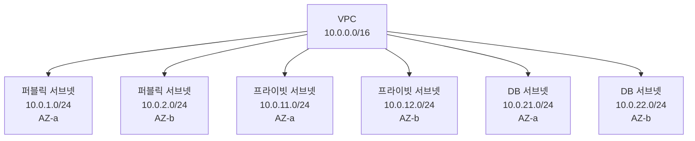
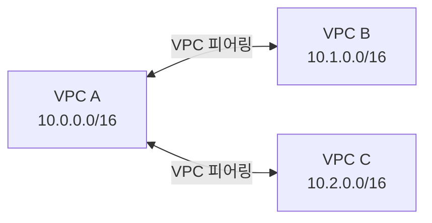
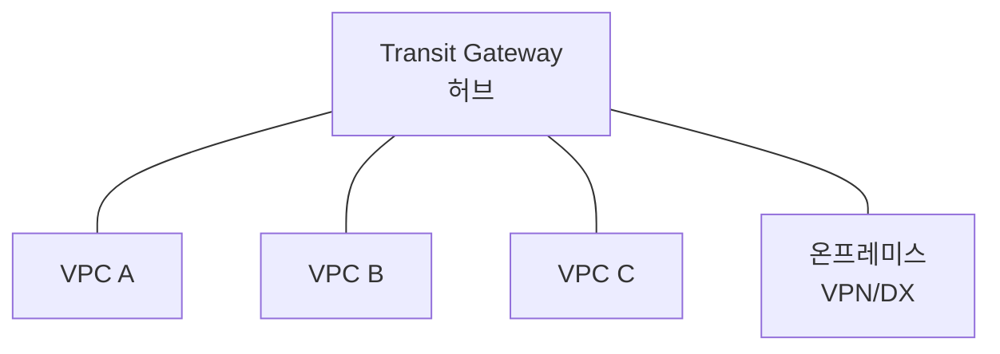
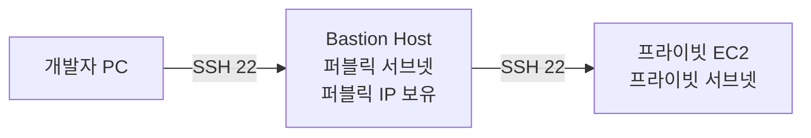
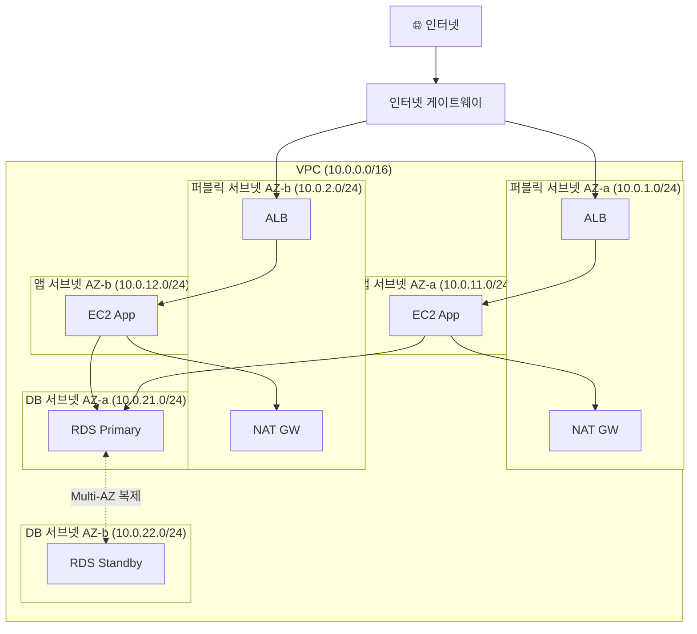
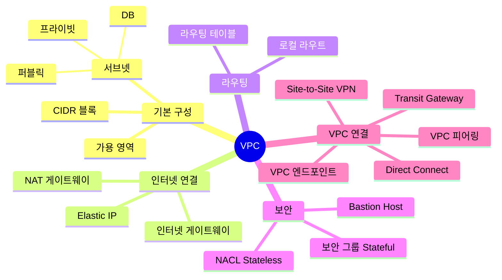

# AWS VPC 심화 정리 — 네트워크 설계의 모든 것

AWS에서 무언가를 배포할 때 가장 먼저 설계해야 하는 것이 바로 **VPC(Virtual Private Cloud)** 입니다. VPC는 AWS 클라우드 내에 완전히 격리된 나만의 가상 네트워크로, EC2, RDS, Lambda 등 거의 모든 서비스의 기반이 됩니다.

이 글에서는 VPC의 핵심 구성요소부터 실무에서 자주 쓰이는 아키텍처 패턴까지 깊이 있게 정리합니다.

---

## 1. VPC란?

VPC는 AWS 클라우드 안에서 **논리적으로 격리된 가상 네트워크 공간**입니다. 마치 기업의 사내 네트워크(인트라넷)를 클라우드 위에 구현한 것과 같습니다.

- **리전(Region) 단위**로 생성됩니다 (AZ에 걸쳐 있음)
- CIDR 블록으로 IP 주소 범위를 정의합니다
- 계정당 리전별 기본 **5개** VPC 생성 가능 (한도 증가 요청 가능)
- AWS는 각 계정에 **기본 VPC(Default VPC)** 를 자동 제공

### 기본 VPC vs 커스텀 VPC

| 항목 | 기본 VPC | 커스텀 VPC |
|------|---------|-----------|
| CIDR | `172.31.0.0/16` 고정 | 직접 설정 |
| 서브넷 | AZ마다 기본 퍼블릭 서브넷 | 직접 설계 |
| 인터넷 연결 | 기본 제공 | 직접 구성 |
| 사용 목적 | 테스트, 빠른 시작 | 운영 환경 |

> ⚠️ 실무 운영 환경에서는 기본 VPC를 사용하지 않고, 보안과 구조를 직접 설계한 **커스텀 VPC**를 사용합니다.

---

## 2. CIDR (IP 주소 범위)

VPC를 만들 때 가장 먼저 결정해야 하는 것이 **CIDR(Classless Inter-Domain Routing)** 블록입니다.

### CIDR 표기법

```
10.0.0.0/16
└───┬───┘ └┬┘
  IP 주소  프리픽스 길이 (고정 비트 수)

/16 → 앞 16비트 고정 → 나머지 16비트로 65,536개 IP 사용 가능
/24 → 앞 24비트 고정 → 나머지 8비트로 256개 IP 사용 가능
```

### AWS VPC CIDR 범위

| CIDR | 사용 가능 IP 수 | 권장 용도 |
|------|--------------|---------|
| `/16` | 65,536 | 대규모 VPC |
| `/20` | 4,096 | 중간 규모 |
| `/24` | 256 | 소규모 서브넷 |
| `/28` | 16 | AWS VPC 최소 단위 |

**사설 IP 대역** (인터넷에서 라우팅 불가):
- `10.0.0.0/8`
- `172.16.0.0/12`
- `192.168.0.0/16`

> 💡 VPC CIDR을 한번 정하면 변경이 어렵습니다. **충분히 큰 범위**로 설계하는 것이 좋습니다. 온프레미스 연결 계획이 있다면 IP 대역이 겹치지 않도록 주의하세요.

---

## 3. 서브넷 (Subnet)

서브넷은 VPC의 IP 주소 범위를 **더 작은 단위로 나눈 것**입니다. **가용 영역(AZ) 단위**로 존재합니다.



### 퍼블릭 서브넷 vs 프라이빗 서브넷

| 항목 | 퍼블릭 서브넷 | 프라이빗 서브넷 |
|------|------------|--------------|
| 인터넷 접근 | 직접 가능 | 불가 (NAT 경유) |
| 라우팅 테이블 | IGW(인터넷 게이트웨이) 연결 | IGW 연결 없음 |
| 퍼블릭 IP | 자동 할당 가능 | 할당 불가 |
| 배치 리소스 | ALB, NAT GW, Bastion Host | EC2 앱 서버, RDS |

### AWS가 예약하는 IP

서브넷의 첫 4개와 마지막 1개 IP는 AWS가 예약합니다.

예) `10.0.0.0/24` (256개 IP):
- `10.0.0.0` — 네트워크 주소
- `10.0.0.1` — AWS VPC 라우터
- `10.0.0.2` — AWS DNS 서버
- `10.0.0.3` — 미래 사용을 위해 예약
- `10.0.0.255` — 브로드캐스트 주소

→ 실제 사용 가능: **251개**

---

## 4. 인터넷 게이트웨이 (IGW)

IGW는 VPC와 인터넷 사이의 **출입문** 역할을 합니다.

- VPC당 1개만 연결 가능
- 수평 확장, 고가용성이 자동으로 보장됨 (관리 불필요)
- IGW 자체는 무료 (데이터 전송 요금은 별도)

```
인터넷
   ↕
인터넷 게이트웨이 (IGW)
   ↕
퍼블릭 서브넷 (라우팅 테이블에 IGW 경로 있음)
   ↕
EC2 인스턴스 (퍼블릭 IP 보유)
```

**퍼블릭 서브넷이 되려면 두 가지가 필요합니다:**
1. 라우팅 테이블에 `0.0.0.0/0 → IGW` 경로 추가
2. 인스턴스에 퍼블릭 IP 또는 Elastic IP 할당

---

## 5. 라우팅 테이블 (Route Table)

라우팅 테이블은 **트래픽이 어디로 향할지 결정**하는 규칙 집합입니다. 서브넷마다 하나의 라우팅 테이블을 연결합니다.

### 퍼블릭 서브넷 라우팅 테이블

| 목적지 | 대상 |
|--------|------|
| `10.0.0.0/16` | local (VPC 내부) |
| `0.0.0.0/0` | igw-xxxxxxxx |

### 프라이빗 서브넷 라우팅 테이블

| 목적지 | 대상 |
|--------|------|
| `10.0.0.0/16` | local (VPC 내부) |
| `0.0.0.0/0` | nat-xxxxxxxx |

> 💡 라우팅은 **가장 구체적인 경로(Longest Prefix Match)** 가 우선입니다. `10.0.1.5`로 가는 트래픽은 `/16`보다 `/24`가 더 구체적이므로 `/24` 규칙을 따릅니다.

---

## 6. NAT 게이트웨이

프라이빗 서브넷의 EC2는 인터넷에 직접 연결할 수 없습니다. 하지만 소프트웨어 업데이트, 외부 API 호출 등 **아웃바운드 인터넷 연결**이 필요할 때 NAT 게이트웨이를 사용합니다.


### NAT 게이트웨이 특징

- **퍼블릭 서브넷에 위치**하며 Elastic IP 필요
- AWS가 완전 관리 (패치, 확장 자동)
- AZ 단위로 생성 → 고가용성을 위해 **AZ마다 1개씩** 권장
- 시간당 요금 + 데이터 처리 요금 발생

### NAT 게이트웨이 vs NAT 인스턴스

| 항목 | NAT 게이트웨이 | NAT 인스턴스 |
|------|-------------|-----------|
| 관리 | AWS 완전 관리 | 직접 관리 |
| 가용성 | 자동 고가용성 | 직접 구성 필요 |
| 대역폭 | 최대 100Gbps | 인스턴스 타입에 따라 다름 |
| 비용 | 높음 | 낮음 (소규모) |
| 권장 | 운영 환경 | 테스트/비용 최소화 |

---

## 7. 보안 그룹 (Security Group)

보안 그룹은 **EC2 인스턴스 수준의 가상 방화벽**입니다.

### 핵심 특성

- **Stateful**: 인바운드를 허용하면 아웃바운드 응답이 자동 허용
- **허용(Allow) 규칙만** 존재 (거부 규칙 없음)
- 여러 인스턴스에 적용 가능, 하나의 인스턴스에 여러 보안 그룹 적용 가능
- 규칙은 즉시 적용

### 보안 그룹 규칙 예시

**웹 서버 보안 그룹:**

| 방향 | 프로토콜 | 포트 | 소스/대상 | 설명 |
|------|---------|------|---------|------|
| 인바운드 | TCP | 80 | 0.0.0.0/0 | HTTP |
| 인바운드 | TCP | 443 | 0.0.0.0/0 | HTTPS |
| 인바운드 | TCP | 22 | 10.0.0.5/32 | SSH (Bastion만) |
| 아웃바운드 | All | All | 0.0.0.0/0 | 모든 아웃바운드 |

**DB 서버 보안 그룹:**

| 방향 | 프로토콜 | 포트 | 소스 | 설명 |
|------|---------|------|------|------|
| 인바운드 | TCP | 3306 | sg-webserver | 웹 서버 SG에서만 |

> 💡 소스/대상에 **다른 보안 그룹 ID**를 지정할 수 있습니다. IP보다 훨씬 유연하고 관리가 편리합니다.

---

## 8. 네트워크 ACL (NACL)

NACL은 **서브넷 수준의 방화벽**입니다. 서브넷에 출입하는 모든 트래픽에 적용됩니다.

### 보안 그룹 vs NACL 비교

| 항목 | 보안 그룹 | NACL |
|------|---------|------|
| 적용 범위 | 인스턴스 수준 | 서브넷 수준 |
| 상태 | Stateful (응답 자동 허용) | Stateless (응답 별도 허용 필요) |
| 규칙 | Allow만 | Allow + Deny |
| 규칙 적용 | 모든 규칙 평가 | 번호 순서대로 (낮은 번호 우선) |
| 기본 동작 | 모두 거부 | 기본 VPC는 모두 허용 |

### NACL 규칙 예시

| 규칙 번호 | 프로토콜 | 포트 | 소스 | 허용/거부 |
|---------|---------|------|------|---------|
| 100 | TCP | 80 | 0.0.0.0/0 | Allow |
| 110 | TCP | 443 | 0.0.0.0/0 | Allow |
| 120 | TCP | 1024-65535 | 0.0.0.0/0 | Allow (임시 포트) |
| * | All | All | 0.0.0.0/0 | Deny |

> ⚠️ NACL은 Stateless이므로 **임시 포트(Ephemeral Port, 1024-65535)** 의 인바운드/아웃바운드를 모두 허용해야 합니다.

---

## 9. VPC 연결 옵션

### VPC 피어링 (VPC Peering)

두 VPC를 **직접 1:1로 연결**합니다. 같은 계정이나 다른 계정, 다른 리전의 VPC도 연결 가능합니다.



- CIDR 대역이 겹치면 피어링 불가
- **전이적 라우팅 불가**: A↔B, B↔C면 A에서 C로 직접 통신 불가 → A↔C 피어링 별도 필요
- 피어링된 VPC 간 트래픽은 AWS 내부 네트워크 통과 (인터넷 미경유)

### Transit Gateway

여러 VPC를 **허브-스포크 방식**으로 중앙에서 연결합니다.



- VPC 피어링과 달리 **전이적 라우팅 지원**
- 수십~수백 개의 VPC 연결에 적합
- 별도 요금 발생

### VPC 엔드포인트 (VPC Endpoint)

인터넷을 거치지 않고 **AWS 서비스에 프라이빗하게 접근**합니다.

| 종류 | 방식 | 지원 서비스 |
|------|------|-----------|
| **게이트웨이 엔드포인트** | 라우팅 테이블 기반 | S3, DynamoDB |
| **인터페이스 엔드포인트** | ENI (프라이빗 IP) 기반 | EC2, SNS, SQS 등 대부분 |

```
프라이빗 서브넷 EC2
      ↓ (인터넷 미경유)
VPC 엔드포인트
      ↓ (AWS 내부 네트워크)
S3 버킷
```

NAT 게이트웨이 비용 절감 + 보안 강화 효과가 있어 실무에서 많이 사용합니다.

### VPN 및 Direct Connect

| 방식 | 설명 | 특징 |
|------|------|------|
| **Site-to-Site VPN** | 온프레미스 ↔ VPC 암호화 터널 | 인터넷 경유, 저비용, 빠른 구성 |
| **Direct Connect** | 전용 물리 회선으로 연결 | 안정적, 고속, 고비용 |

---

## 10. Bastion Host 패턴

프라이빗 서브넷의 EC2에 SSH로 접속할 때 사용하는 패턴입니다.



- Bastion Host는 퍼블릭 서브넷에 위치
- 보안 그룹에서 특정 IP에서만 SSH 허용
- 프라이빗 EC2의 보안 그룹은 Bastion Host SG에서만 SSH 허용

> 💡 최근에는 Bastion Host 대신 **AWS Systems Manager Session Manager**를 사용해 SSH 포트 없이 안전하게 접속하는 방법이 권장됩니다.

---

## 11. 실무 VPC 아키텍처 설계

### 3-Tier 아키텍처 (가장 일반적인 패턴)



### 서브넷 설계 원칙

1. **AZ마다 동일한 구성**: 고가용성을 위해 각 AZ에 동일한 서브넷 티어 구성
2. **역할별 분리**: 웹 / 앱 / DB 레이어를 별도 서브넷으로 분리
3. **충분한 IP 여유**: 향후 확장을 고려해 넉넉하게 설계
4. **NAT GW는 AZ마다**: 단일 NAT GW는 장애 시 전체 프라이빗 서브넷 인터넷 단절

---

## 12. VPC 핵심 개념 정리



---

## 마무리

VPC는 AWS 네트워크 설계의 **핵심 기반**입니다. 처음에는 복잡해 보이지만, 실제로 VPC를 직접 만들고 서브넷, 라우팅 테이블, 보안 그룹을 설정해보면 구조가 명확하게 이해됩니다.

핵심 정리:
- **서브넷**: AZ 단위로 퍼블릭/프라이빗 분리
- **IGW**: 퍼블릭 서브넷의 인터넷 관문
- **NAT GW**: 프라이빗 서브넷의 아웃바운드 전용 인터넷 경로
- **보안 그룹(Stateful)** + **NACL(Stateless)** 이중 보안
- **3-Tier 아키텍처**: 실무 기본 설계 패턴

> 📌 다음 글에서는 **EC2 심화 정리**를 다룰 예정입니다. 인스턴스 타입, 스토리지, AMI, Auto Scaling 그룹 설계까지 자세히 살펴봅니다.
