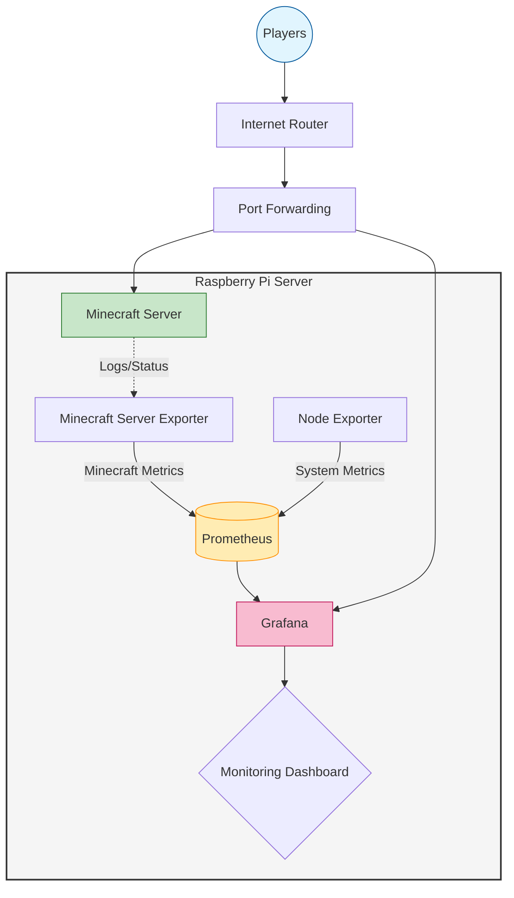

# Raspberry Pi 기반 Minecraft 서버 운영 및 모니터링 구축 프로젝트

## (DevOps / SRE 포트폴리오 프로젝트)

------------------------------------------------------------------------

# 1. 프로젝트 개요

## 프로젝트 목적

단순 Minecraft 게임 서버 구축에서 시작하여 서버 운영 중 발생하는 다양한
문제들을 해결하면서 **모니터링 시스템 구축, 장애 분석, 성능 최적화 경험
확보**를 목표로 진행한 개인 인프라 프로젝트.

## 프로젝트 목표

-   안정적인 Minecraft 서버 운영
-   Prometheus 기반 메트릭 수집
-   Grafana 기반 시각화
-   장애 감지 시스템 구축
-   성능 병목 분석 환경 구성
-   Linux 서버 운영 경험 확보

------------------------------------------------------------------------

# 2. 시스템 아키텍처

## 전체 구성도
------------------------------------------------------------------------

--- 
# 3. 기술 스택

## Infrastructure

-   Raspberry Pi
-   Linux
-   USB Storage (World Data)

## Monitoring

-   Prometheus
-   Grafana
-   Node Exporter
-   Minecraft Prometheus Exporter

## Server

-   Paper Minecraft Server
-   Java JVM

## Tools

-   Bash
-   Cron
-   Systemd
-   SSH

------------------------------------------------------------------------

# 4. 수행 작업

# 4.1 Minecraft 서버 구축

## 서버 실행

    java -Xms2G -Xmx4G -jar paper.jar nogui

## 주요 설정

성능 최적화:

-   view-distance 감소
-   entity limit 설정
-   Paper async 옵션 확인

------------------------------------------------------------------------

# 4.2 Storage 구조 개선

## 문제

SD 카드 I/O 성능 문제로:

    java.io.IOException
    failed to write chunk data

발생.

## 해결

World 데이터를 USB 저장소로 이동:

    mv world /mnt/usb/
    ln -s /mnt/usb/world world

확인:

    ls -l

결과:

    world -> /mnt/usb/world

효과:

-   Chunk 저장 오류 감소
-   IO 안정성 향상

------------------------------------------------------------------------

# 4.3 네트워크 문제 해결

## 문제

외부 접속 불가.

## 원인 분석

확인 항목:

    ss -lntp

    curl ifconfig.me

    speedtest

문제 발견:

업로드 속도 0.55mbps.

## 해결

-   QoS 확인
-   공유기 설정 점검
-   서버 업로드 부담 감소

-> 외부 단말기 원인 -> 고객센터 문의 후 정상

------------------------------------------------------------------------

# 4.4 Monitoring 구축

## Prometheus 구조

    Minecraft Exporter → Prometheus → Grafana
    Node Exporter → Prometheus

------------------------------------------------------------------------

# Prometheus 설정

## prometheus.yml

    scrape_configs:

      - job_name: minecraft
        static_configs:
          - targets:
            - localhost:9940

      - job_name: node
        static_configs:
          - targets:
            - localhost:9100

------------------------------------------------------------------------

# 5. Grafana Dashboard 설계

## 수집 지표

Minecraft:

-   TPS
-   Players
-   JVM Memory
-   GC

System:

-   CPU
-   Memory
-   Disk
-   Network

------------------------------------------------------------------------

# 6. PromQL 예시

## CPU Usage

    100 - avg by(instance)(
    rate(node_cpu_seconds_total{mode="idle"}[1m])
    ) * 100

## Network

Download:

    rate(node_network_receive_bytes_total[1m]) * 8

Upload:

    rate(node_network_transmit_bytes_total[1m]) * 8

## Disk IO

Read:

    rate(node_disk_read_bytes_total[1m])

Write:

    rate(node_disk_written_bytes_total[1m])

------------------------------------------------------------------------

# 7. JVM Memory 분석

## Metrics

    mc_jvm_memory{type="allocated"}
    mc_jvm_memory{type="free"}
    mc_jvm_memory{type="max"}

## 문제

No data 발생.

## 원인

Prometheus vector label mismatch.

## 해결

    sum(mc_jvm_memory{type="allocated"})
    -
    sum(mc_jvm_memory{type="free"})

------------------------------------------------------------------------

# 8. Alert 설계

## TPS Alert

    mc_tps < 15

## CPU Alert

    100 - avg(rate(node_cpu_seconds_total{mode="idle"}[1m])) * 100 > 90

## Server Down

    up{job="minecraft"} == 0

------------------------------------------------------------------------

# 9. 자동 대시보드 실행

## 목적

서버 상태 모니터링 화면 상시 표시.

## 방법

Chromium kiosk mode:

    chromium-browser --kiosk http://localhost:3000

autostart:

    ~/.config/autostart/grafana.desktop

------------------------------------------------------------------------

# 10. Troubleshooting 사례

## 사례 1

node_cpu_seconds_total 없음.

원인:

Node exporter 미설치.

해결:

    sudo apt install prometheus-node-exporter

------------------------------------------------------------------------

## 사례 2

Grafana No data.

원인:

Prometheus target 미연결.

확인:

    Status → Targets

------------------------------------------------------------------------

## 사례 3

Chunk write error.

원인:

Disk I/O.

해결:

Storage 변경.

------------------------------------------------------------------------

# 11. 성과

## 기술적 성과

-   Linux 운영 경험
-   Prometheus Monitoring 구축
-   Grafana Dashboard 설계
-   네트워크 문제 해결 경험
-   Storage 구조 개선 경험
-   JVM Memory 이해

## 운영 경험

-   장애 분석
-   로그 기반 문제 해결
-   성능 튜닝
-   서비스 안정화

------------------------------------------------------------------------

# 12. 개선 가능 영역

추가 예정:

-   Loki 로그 통합
-   Discord Alert
-   자동 백업
-   TPS anomaly detection
-   Entity monitoring
-   Multi server monitoring

------------------------------------------------------------------------

# 13. 배운 점

단순 게임 서버 운영이 아닌:

-   Infrastructure 운영
-   Monitoring 설계
-   장애 대응
-   Performance tuning

경험 가능.

특히:

문제 발생 → 원인 분석 → 해결 → 개선

과정 반복 경험.

------------------------------------------------------------------------

# 14. DevOps 관점 정리

본 프로젝트에서 수행한 역할:

Infrastructure: - Linux server 운영

Monitoring: - Prometheus - Grafana

Reliability: - 장애 대응 - Monitoring

Operations: - Server tuning - Storage optimization

------------------------------------------------------------------------

# 15. 향후 목표

확장 계획:

-   Docker 기반 서버 실행
-   Reverse Proxy 구성
-   CI/CD 자동 배포
-   Kubernetes 테스트
-   Observability 확장

------------------------------------------------------------------------

# 16. 결론

Raspberry Pi 기반 Minecraft 서버는:

실제 인프라 운영과 유사한 환경을 제공.

이를 통해:

-   Monitoring 구축
-   Troubleshooting 경험
-   System 이해

확보 가능.

본 프로젝트는 DevOps / SRE 역량 향상을 위한 실습 프로젝트로 활용 가능.

------------------------------------------------------------------------

# Author

Personal Infrastructure Project

Monitoring / Linux / Server Operations Practice Project
